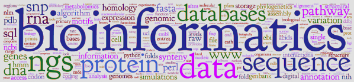

# Bioinformatics (CMPSC 300) Final Project

This repository contains information about the final project deliverables. This final project
invites students to find an area of bioinformatics in which to complete basic research.
This area can be comprised of anything that we have handled in class or anything
that has been found in the literature of the discipline.

## Dates

Handed out: 18 November 2022

Presentations: 5th December - 9th December, 2022

Final Submission Due: 19th December 2022, 9:00am


Caption: Bioinformatics comprises a lot of different areas to explore and to study.
In many of these areas, there are plenty _low-hanging fruit_, or discoveries
that can be made with seemingly very little effort.

## Contents

- [Objectives](#Objectives)
- [Timeline](#Timeline)
- [Motivation](#Motivation)
- [Research Task](#Research_Task)
- [Individual Tasks](#Individual_Tasks)
- [Sample Research Questions](#Sample_Research_Questions)
- [Cloning Your Repository](#Cloning_Your_Repository)
- [GatorGrade](#GatorGrade)
= [Assessment](#Assessment)


## Objectives

* To learn good practices in locating, reading and understanding literature to
form a feasible research question.

* To determine a feasible research question which is be supported by facts
from articles of the literature.

* To gain skill in locating data which is appropriate for the project.

* To complete some original research using selected tools, methods and /or
other resources from the literature.

* To interpret results and to form educated conclusions.

* To think critically about the outcome of the bioinformatics research in
terms of ethical considerations:  data handling, fairness, justice, liability, accountability, for example.

## Timeline

Activity                                                                      | Deadline
----------------------------------------------------------------------------- | ------------------------------------------
`writing/proposal.md`: Create a team and complete proposal of study. Discuss relevance to Bioinformatics. | By end of class; 11:00am on Monday, November 21st, 2022
`writing/progress.md`: Demonstrate progress during class work time (commits from each member). Addition of data, references, notes, etc. to show that your project is building. | By end of lab; 4:20pm on Monday, November 28th, 2022
`writing/report.md`: Final report due.| By 19th December 2022, 9:00am
Presentation of research and discussion of results | 5th December - 9th December, 2022 (Exact date TBA)

## Motivation

Throughout the semester, we have spent time to investigate many of the commonly
used approaches, methods, tools and other resources which are available to
research in Bioinformatics. We studied methods of selecting data to be applied
to these resources and we spent time for critical reasoning about implications in research.
Some (but not all!) of the computational tools we used are listed below.

 * Global Alignment: Needleman-Wunch
 * Local Alignment: Smith-Waterman sequence alignment algorithms
 * NCBI's Pubmed
 * Blast
 * Uniprot
 * String-db

## Research Task

In this final project, you are invited to work as an individual or as a group, _of two or three members_, to apply some of the above resources to implement a research project that you have designed yourself. In this project, you are to use literature, obtain data and apply resources from the Bioinformatics community.

In particular, this final project invites you to complete original research (in an area of interest to you)
where you demonstrate your ability to select a _feasible_ research question with the support of peer-reviewed scientific
articles and publicly available (online) resources. 


### Individual Tasks

The tasks of the project are the following.

* __Literature review__: Determine a research question which is supported by at least three peer-reviewed articles.

* __Data__: Obtain the data for the project from a publicly available online resource.

* __Research Question__: State the research question in clear and meaningful language. The form of some sample research questions have been added below.

* __Computational Tool(s)__: Choose computational tool(s) for your experiments and analysis. Be sure that you can justify the involvement of this tool for your research question. In other words, please be sure that the tool is appropriate and leads to knowledge to resolve the research question.

* __Analysis and Critical Reasoning__: Once you have identified a research question and computational tools to use, the experiments and analyses will begin. Here you will have results to process in order to make educated conclusions which resolve the research question. You must produce visual outcomes (for example, plots, charts, networks, alignment tables, etc.). As you study the results, think about what types of __plausible__ conclusions may be drawn from the results. Once you have determined a logical explanation for the results, you are ready for the next step.

* __Conclusions__: Write down your conclusions. Try to justify or corroborate them with other facts from articles or other resources.  

* __Ethics__: At the end of this work, you are to reflect over the types of potential ethical trouble which could negatively impact the project, involved-people, environment or similar. In other words, ask yourself what potential ethical failures could be prevented by some type of adjustment. Discuss your thinking. 


### Sample Research Questions

Potential research questions may be comparable to the following:

* I have a protein. Where else is the protein found and how do characteristics of the protein (i.e., function, structure, synteny, etc) differ across diverse organisms.
* I extracted a coding region of DNA from a Genbank record. Does this coding region show up in the genomes of other organisms? It the extracted sequence ever found in the _non-coding_ regions of any species?
* I have found a pseudogene (i.e., a sequence of DNA that contains structure to suggest that it is a gene but it is actually not a gene). What other actual genes is this pseudogene gene similar? What else can I find about this pseudogene from the literature about its status as a defunct gene? 
* I have a gene from a common bacterium. What other bacterial organisms contain this gene. Does having this gene imply Horizontal Gene Transfer?
* I have a three-dimensional image of protein and another image of a related protein. How can studying the domains of each protein help me to determine function?
* I have isolated a protein domain. Can I find this domain in other proteins? In what ways does this protein domain contribute to general protein function when it is compared to other types of proteins?


## Cloning Your Repository

To use the link that you were given in class, please follow the steps below.

- Click on the link and accept the assignment.
- Once the importing task has completed, click on the created assignment link which will take you to your newly created GitHub repository for this lab.
- Clone this repository (bearing your name) and work locally.
- As you are working on your lab, you are to commit and push regularly. The commands are the following.

```
git add -A
git commit -m ``Your notes about the commit here''
git push
```

After you have pushed your work to your repository, please visit the repository at the GitHub website (you may have to log-in using your browser) to verify that your files were correctly sent.

### Individually

* If you are working alone, you will still need to establish a group name due to the setup in GitHub Classrooms.

### As a Group

* If you are working in a group, first, decide who will be in your group before you click on the link. In group assignments, _only one person will be creating the team while the other team members will join that team._  The selected person of the team should click on the link of the assignment sheet to establish a group name that is unique and descriptive. Use the `Create a new team` option.

* Now the other members of the team can click on the assignment link and select their team from the list under _Join an Existing Team._ When other team members join their group in GitHub Classroom, a team is created in our GitHub organization. Every team member will be able to push and pull to their team’s repository.

* As you work in groups, please work collaboratively and leave no-one out of the loop of your thinking: working in groups is one of the best ways to add focus to your project and to develop ideas (by brainstorming).

## GatorGrade

You can check the baseline writing and commit requirements for this lab assignment by running department's assignment checking `gatorgrade` tool. To use `gatorgrade`, you first need to make sure you have Python3 installed (type `python --version` to check). If you do not have Python installed, please see:

- [Setting Up Python on Windows](https://realpython.com/lessons/python-windows-setup/)
- [Python 3 Installation and Setup Guide](https://realpython.com/installing-python/)
- [How to Install Python 3 and Set Up a Local Programming Environment on Windows 10](https://www.digitalocean.com/community/tutorials/how-to-install-python-3-and-set-up-a-local-programming-environment-on-windows-10)

Then, if you have not done so already, you need to install `gatorgrade`:

- First, [install `pipx`](https://pypa.github.io/pipx/installation/)
- Then, install `gatorgrade` with `pipx install gatorgrade`

Finally, you can run `gatorgrade`:

`gatorgrade --config config/gatorgrade.yml`

## Deliverables
See due dates in the above Timeline table.

* Address `writing/proposal.md` for proposal.

* Address `writing/progress.md` for progress.

* Address `writing/report.md` for final report.


## Assessment

The grade that a student receives on this assignment will have the following components.

- **GitHub Actions CI Build Status [up to 5%]:** For the project repository associated with this assignment students will receive a checkmark grade if their last before-the-deadline build passes. This is only checking some baseline writing and commit requirements as well as correct inclusion of files. An additional reduction will given if the commit log shows a cluster of commits at the end clearly used just to pass this requirement. An addition reduction will also be given if there is no commit during lab or class project work times. All other requirements are evaluated manually.

- **Timely Submission of Proposal and Progress documents [up to 20%]:** Students will also receive a check mark for the submissions for `writing/proposal` and `writing/progress.md` that demonstrate clear project idea and sufficient progress and contain all information requested in those documents' TODO tags. 

- **Mastery of Bioinformatics Skills [up to 50%]:**: Students will also receive a check mark grade when their project demonstrates proficiency in posing, understanding, and correctly responding to Bioinformatics question(s). A part of this grade is based on the responses to the writing questions presented in the `report.md`. The submitted writing should have correct spelling, grammar, and punctuation in addition to following the rules of Markdown and providing conceptually and technically accurate answers. Additionally, all steps of the inquiry must be clearly demonstrated and all visual output must be included in the report. Any produced code must be included in the `src/` directory of the project repository.

- **Mastery of Oral Communication [up to 25%]**: Students will receive a portion of their assignment grade when the team presentation shows a complete understanding of the completed work and ability to communicate its ideas.
